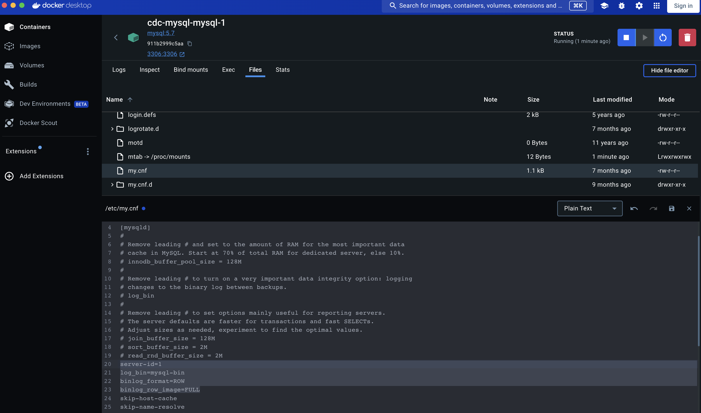

# cdc-mysql

## Setup
1. Run docker
```
docker compose run --build
```

2. You can user DBeaver to access to Mysql
```
- serverhost: localhost
- database: prod
- username: root
- password: password
```


3. In the DBeaver, you shoud create schema and table to test, like the following sql script:
```
CREATE TABLE prod.users (
    id INT AUTO_INCREMENT PRIMARY KEY,
    name VARCHAR(100) NOT NULL,
    email VARCHAR(100) NOT NULL
);
```

4. Turn on bin log (operation log) in Mysql to use CDC.
Copy the following config and paste to the file `/etc/my.cnf` in the mysql container. Then, saving and restarting this container
```
server-id=1
log_bin=mysql-bin
binlog_format=ROW
binlog_row_image=FULL
```


5. Create connector
```
curl -X POST -H "Content-Type: application/json" --data '{
  "name": "mysql-connector-1",
  "config": {
    "connector.class": "io.debezium.connector.mysql.MySqlConnector",
    "database.hostname": "mysql",
    "database.port": "3306",
    "database.user": "root",
    "database.password": "password",
    "database.server.id": "184054",
    "topic.prefix": "fullfillment",
    "database.include.list": "prod",
    "schema.history.internal.kafka.bootstrap.servers": "kafka:9092",    
    "schema.history.internal.kafka.topic": "schemahistory.fullfillment",
    "include.schema.changes": "true"
  }
}' http://localhost:8083/connectors
```

6. Running consumer
in the root of directory and run this command line
```
python app/common/main.py
```

## Test infra
1. Insert into table
```
INSERT INTO prod.users (name, email) VALUES ('Long Le 1', 'long.le1@example.com');
INSERT INTO prod.users (name, email) VALUES ('Long Le 2', 'long.le2@example.com');
INSERT INTO prod.users (name, email) VALUES ('Long Le 3', 'long.le3@example.com');

UPDATE prod.users
SET name = 'Long Le 1 update'
WHERE NAME = 'Long Le 1'


DELETE FROM prod.users
WHERE id=2
```

2. Check if messsage exist in kafka or not
```
kafka-topics --list --bootstrap-server kafka:9092
kafka-console-consumer --topic fullfillment.prod.users --bootstrap-server kafka:9092 --from-beginning
```


## Test code
1. Setup mc (macOS):
```
brew install minio/stable/mc
```

2. config mc to connect to Minio
```
mc alias set myminio http://localhost:9000 minio minio123

```

3. Test mc
```
mc ls myminio

```

4. try to insert data into DB
```
INSERT INTO prod.users (name, email) VALUES ('Long Le 1', 'long.le1@example.com');
INSERT INTO prod.users (name, email) VALUES ('Long Le 2', 'long.le2@example.com');
INSERT INTO prod.users (name, email) VALUES ('Long Le 3', 'long.le3@example.com');

UPDATE prod.users
SET name = 'Long Le 1 update'
WHERE NAME = 'Long Le 1'


DELETE FROM prod.users
WHERE id=2
```

5. Check in the minio
```
mc ls myminio/bucket-user-test/test/<year>/<month>/<day>/type=<json/parquet>/  
example:
 - mc ls myminio/bucket-user-test/test/2024/07/09/type=parquet/
 - mc ls myminio/bucket-user-test/test/2024/07/09/type=json/ 
```
